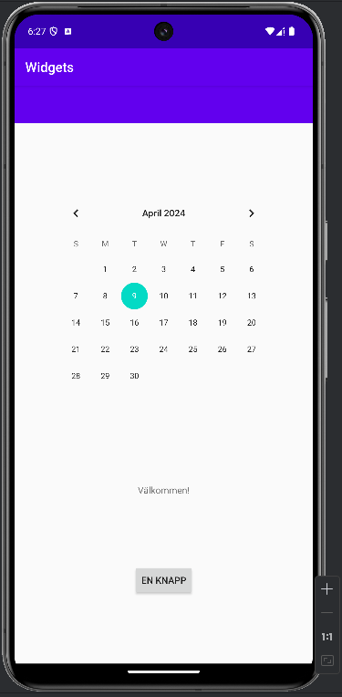

# Rapport Oskar Steise 

- Jag har valt att använda en constraint layout för att presentera mina views. 
- Jag har lagt till ett antal olika views, i form av en toolbar, en calender, en text och en knapp.
- Samtliga har fått lämpliga ID:n och har placerats ut i förhållande till varandra. Kalendern har
exempelvis fått 'constraints' att dess top ska förhålla sig till botten av toolbaren och dess botten
till toppen av texten under. Detta kan ses i kodsnutten under. 
- Deusstom har jag lagt till margin åt alla håll på TextView och i botten på knappen. 
```
    <CalendarView
        android:id="@+id/myCalendar"
        android:layout_width="wrap_content"
        android:layout_height="wrap_content"
        app:layout_constraintBottom_toTopOf="@id/myText"
        app:layout_constraintLeft_toLeftOf="parent"
        app:layout_constraintRight_toRightOf="parent"
        app:layout_constraintTop_toBottomOf="@id/toolbar"
        />
```



